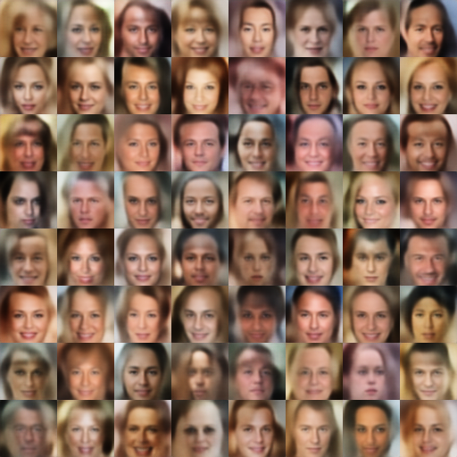

# Adversarial Variational Bayes
This repository contains the code to reproduce the relevant results from the paper [Adversarial Variational Bayes: Unifying Variational Autoencoders and Generative Adversarial Networks](https://arxiv.org/abs/1701.04722).


# Dependencies
Before running the code, you have to install
* [Tensorflow 1.0](https://www.tensorflow.org/)
* [Numpy](http://www.numpy.org/)
* [Scipy](https://www.scipy.org/)
* [Matplotlib](http://matplotlib.org/)
* [tqdm](https://pypi.python.org/pypi/tqdm)
* [ite-toolbox](https://bitbucket.org/szzoli/ite-in-python/)

The former 5 dependencies can be installed using pip by running
```
pip install tensorflow-gpu numpy scipy matplotlib tqdm
```

# Usage
The ``scripts`` folder contains examples scripts to run the code in the repository.

# Results

## MNIST
Samples:


## CelebA
Samples:



Interpolations:


